<div align="center">



*What happens when a project spends two years shortening the distance between "I know this rule" and "the engine knows it."*

[](https://github.com/Automattic/harper)
[](LICENSE.md)


-ef6fd0)

</div>

> **A study, not a fork.** This repo contains **no harper source** beyond short quoted spans used as
> evidence. Harper is Apache-2.0 and lives at
> [Automattic/harper](https://github.com/Automattic/harper). We cloned it, read it, and wrote down
> what we found. Nothing here is official or endorsed.

> [!IMPORTANT]
> **The one-way rule.** When this map and the harper source disagree, **the harper source wins and
> the map gets fixed.** Authority runs `harper source → this map → any decision downstream`, one
> direction only. That rule is the entire reason we can treat a map of somebody else's codebase as
> ground truth with a straight face.

## Why this repo is named after a rule language

We set out to answer one question — *is harper useful to [Trellis](https://github.com/OpenCnid), and
in what shape?* — and refused to answer it from the README. So we reverse-engineered the project from
its own record: **4,460 commits, 2,266 pull requests, 226 releases, 135 authors, Oct 2023 → Jul 2026.**

The answer turned out not to be "the grammar checker." It was **Weir**.

Weir is harper's declarative rule language, born `46f4547f` on 2026-01-12. A rule is a file:

```
expr main (a couple of more)

let message "The correct wording is `a couple more`, without the `of`."
let description "Corrects `a couple of more` to `a couple more`."
let kind "Redundancy"
let becomes "a couple more"

test "There are a couple of more rules that could be added, how can I contribute?" "There are a couple more rules that could be added, how can I contribute?"
```

That's the whole thing. The match, the metadata, the fix — **and its tests, in the same artifact.** A
build script scans the directory and generates the registry; a generated harness runs every shipped
rule's assertions, and nobody maintains a test file. Within six months, **42.6% of all rule-adding
commits chose Weir over hand-written Rust.**

The interesting part is the honesty check that same design makes possible. We measured it: **64 of
351 rules ship zero assertions, and the generated test still passes.** A self-testing artifact needs
a floor enforced at *registration*, not merely a runner. That single finding is worth more to us than
the grammar checking ever was.

## The ladder

Weir didn't arrive out of nowhere. It's the fourth rung of the clearest arc in the whole history:

| Rung | Born | What changed |
|---|---|---|
| Hand-rolled Rust | `309d840e`, 2024-01-15 | Every rule is a bespoke scanner |
| `Pattern` | `6107594e`, 2024-09-01 | A closed algebra of matchers; rules declare a shape |
| `Expr` | `a8fb0c6d` (#1393), 2025-06-13 | A match returns a **`Span`**, not a length — so one traversal serves 279 rule files |
| **Weir** | `46f4547f` (#2357), 2026-01-12 | The rule becomes **data**, carrying its own tests |
| **Weirpack** | `3a5cd68b` (#2491), 2026-02-03 | The rule *set* becomes a **distributable unit** — manifest, rules, optional dictionary |

Every rung still lowers onto the one below. Nothing was replaced — and [that non-replacement is
itself a finding](docs/density-chain/DENSITY-CHAIN.md#c2).

## What's in here

| Path | What it is |
|---|---|
| **[`docs/density-chain/DENSITY-CHAIN.md`](docs/density-chain/DENSITY-CHAIN.md)** | **The map.** A trunk plus nine branches, each a five-tier chain of density. 16,000 words, every claim addressed. |
| [`docs/density-chain/DENSITY-CHAIN.html`](docs/density-chain/DENSITY-CHAIN.html) | The same thing, rendered — theme-aware, self-contained, no external requests |
| [`findings/`](findings/) | The five skill outputs, in run order: SPARK diagnosis, sub-agent composition, the judge panel, the complexity convocation |
| [`findings/branches/`](findings/branches/) | The nine cartographer returns, unedited |

## The method, in one paragraph

Nine read-only sub-agents, one per subsystem class, spawned in parallel from a single byte-identical
ground block and a rigid five-tier return frame. None could see another's output. Each had to carry a
`path:line`, commit SHA, or PR number on **every** quantitative claim, had to fill an `## Uncovered`
slot so gaps couldn't hide as silence, and was forbidden to run `cargo`, `pnpm`, `just`, or `npm`. The
trunk and the cross-links were composed afterwards by the orchestrator, because a sibling speculating
about a class it can't see produces exactly the unreconcilable claim the discipline exists to prevent.

Total run: **1,283,821 tokens, 558 tool calls, zero lines of harper executed.**

## What we found that harper's maintainers might want

Offered as observations, not as patches — see [`AGENTS.md`](AGENTS.md) on why we haven't opened issues.
Every one is dated 2026-07-23/24 and derived from reading, never from an executed counterexample:

- **`PatchCriteria::WordIs` zips characters without a length check**, making it a prefix match — and
  158 of the 201 patches in the shipped tagger model route through it. ([C6](docs/density-chain/DENSITY-CHAIN.md#c6))
- **`statsPath` is assigned to `base.file_dict_path`**, so the stats location has never been settable,
  and the error message still says "fileDict". ([C8](docs/density-chain/DENSITY-CHAIN.md#c8))
- **`WordId` keys the dictionary by a lossy 64-bit case-folded hash**, so canonical spelling is
  last-write-wins. (Already known: issue #2411.) ([C5](docs/density-chain/DENSITY-CHAIN.md#c5))
- **`harper-desktop/.github/workflows/` sits below the repo root**, so Actions never reads it — and it
  invokes two recipes that don't exist. ([C8](docs/density-chain/DENSITY-CHAIN.md#c8))
- **Two TLD tables**, 15 entries and 106, in the same crate. ([C1](docs/density-chain/DENSITY-CHAIN.md#c1))

## Standing on the shoulders of giants

Harper is built by **Elijah Potter** (2,409 of its 4,460 commits) with **Andrew Dunbar**,
**hippietrail**, **Grant Lemons**, **Matthew Espino**, and 130 other contributors, under the
**Automattic** umbrella. Apache-2.0. It is genuinely excellent software and this map exists because we
admired it enough to read all of it.

The method is **Chain of Density**:

> Griffin Adams, Alex Fabbri, Faisal Ladhak, Eric Lehman, Noémie Elhadad.
> *From Sparse to Dense: GPT-4 Summarization with Chain of Density Prompting.*
> New Frontiers in Summarization Workshop, 2023. arXiv:2309.04269.

Canonical method docs live in [chain-of-density](https://github.com/OpenCnid/chain-of-density) — linked,
never copied, so there's one home and no drift.

## Want harper? One command, straight from the source

We don't host other people's code:

```bash
git clone https://github.com/Automattic/harper.git
```

Or just use it — [writewithharper.com](https://writewithharper.com).

## Cite the humans, not us

```bibtex
@misc{adams2023sparsedense,
  title         = {From Sparse to Dense: {GPT-4} Summarization with Chain of Density Prompting},
  author        = {Adams, Griffin and Fabbri, Alex and Ladhak, Faisal and Lehman, Eric and Elhadad, No{\'e}mie},
  year          = {2023},
  eprint        = {2309.04269},
  archivePrefix = {arXiv},
  primaryClass  = {cs.CL},
  url           = {https://arxiv.org/abs/2309.04269}
}

@software{harper,
  title  = {Harper: Offline, privacy-first grammar checker},
  author = {Potter, Elijah and {The Harper Contributors}},
  year   = {2026},
  url    = {https://github.com/Automattic/harper},
  note   = {Apache-2.0}
}
```

## Honest notes

- **Nothing was executed.** Every test count is a count of `#[test]` attributes or `test` lines in
  source — *not a green run*. Every defect above is derived from reading.
- **Reachability is workspace-scoped.** "No non-test caller" means none inside harper's own workspace.
- **T5 records requests, not commitments.** An open PR means somebody asked, not that a maintainer agreed.
- **This is a snapshot of a fast-moving target.** Harper merges roughly 60 PRs a month. The
  "frontier" sections decay fastest; some are probably already stale. Pinned to `efa59c33`, verified 2026-07-24.
- **Written by a human and an AI together.** The reading, the counting, and the drafting were done by
  Claude under [OpenCnid](https://github.com/OpenCnid) direction; the questions, the scope, and the
  judgment about what mattered are the owner's. Where the map is wrong, it's ours to fix.

---

<div align="center">

*Two years of commits, one rule language, and a test suite that passes 64 times without being asked anything.*

</div>
